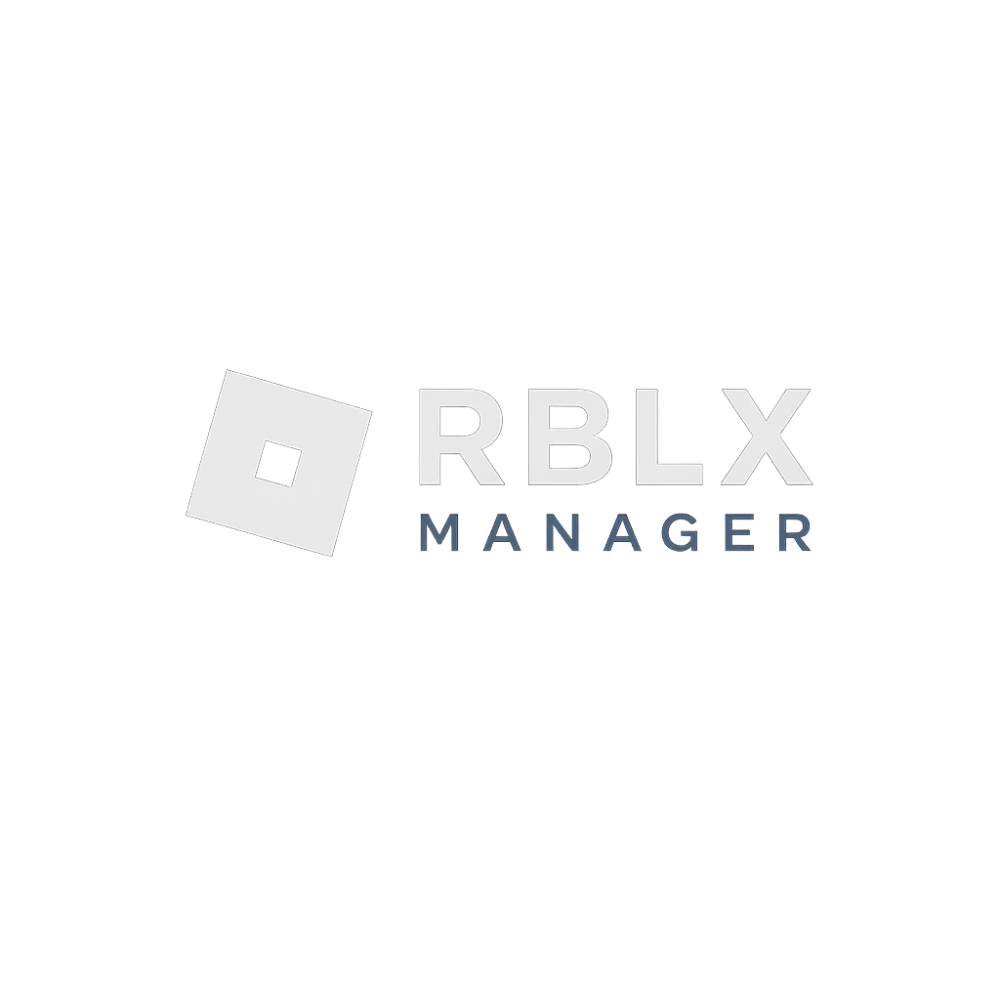

<p align="center">
  
</p>

<h1 align="center">RBLX Manager</h1>
<p align="center">
  <strong>A premium multi-account Roblox manager for Windows</strong>
</p>
<p align="center">
  <a href="https://github.com/joaoswu/RBLXManager/releases/latest"></a>
  <a href="https://github.com/joaoswu/RBLXManager/stargazers"></a>
  
</p>

---

## ✨ Features

- **Multi-Account Management** — Add, switch, and manage multiple Roblox accounts with secure cookie-based auth
- **Account Inspector** — View display name, Robux balance, and account status at a glance
- **Quick Launch** — Launch Roblox instances for any account directly, with private server & Job ID support
- **Group Launch** — Launch multiple accounts simultaneously with smart delays
- **Favorites System** — Mark favorite accounts and launch them all in one click
- **Tag Organization** — Color-coded tags to organize accounts by purpose (Alts, Main, Trading, etc.)
- **Home Dashboard** — Stats overview showing total accounts, active sessions, total Robux & more
- **Theme Accents** — Choose from Emerald, Ocean, Sunset, Purple, and Rose color themes
- **Settings Persistence** — All settings saved locally and restored on next launch
- **Log Manager** — View and clean application logs from within settings
- **PIN Lock** — Protect your accounts with an optional PIN
- **Discord Rich Presence** — Show your RBLX Manager status on Discord

## 📥 Download

1. Go to the [**Releases**](https://github.com/joaoswu/RBLXManager/releases/latest) page
2. Download `RBLXManager-v*-win-x64.exe`
3. Run the `.exe` — no installation needed!

> **Note:** Windows SmartScreen may show a warning on first launch since the app isn't code-signed. Click **"More info" → "Run anyway"** to proceed.

## 🛠️ Build from Source

### Prerequisites
- [.NET 9 SDK](https://dotnet.microsoft.com/download/dotnet/9.0)

### Build & Run
```bash
git clone https://github.com/joaoswu/RBLXManager.git
cd RBLXManager
dotnet run
```

### Publish Single-File EXE
```bash
dotnet publish -c Release -r win-x64 --self-contained true -p:PublishSingleFile=true -o ./publish
```

The output `RBLXManager.exe` will be in the `./publish` folder.

## 🗂️ Project Structure

```
├── App.xaml / App.xaml.cs        # Application entry point & global resources
├── MainWindow.xaml / .cs         # Main UI and all business logic
├── LoginWindow.xaml / .cs        # Cookie login dialog
├── DiscordRpc.cs                 # Discord Rich Presence integration
├── RblxManager.csproj            # Project configuration
├── AppIcon.ico / .png            # Application icon
└── .github/workflows/release.yml # Automated build & release pipeline
```

## 📜 License

This project is provided as-is for personal use. Use at your own risk.

---

<p align="center">Made with ❤️ by <a href="https://github.com/joaoswu">joaoswu</a></p>
